# splinepy
[](https://github.com/tataratat/splinepy/actions)
[](https://badge.fury.io/py/splinepy)
[](https://mybinder.org/v2/gh/tataratat/try-splinepy/main)

splinepy is a python library for splines of arbitrary dimensions and degrees.
The library supports Bezier, Rational Bezier, BSpline and NURBS with fast and easy-to-use APIs.

## Install guide
splinepy wheels are available for python3.8+ for MacOS, Linux, and Windows:
```bash
# including all optional dependencies
pip install "splinepy[all]"  # quotation marks required for some shells
# or
pip install splinepy
```


You can install it directly from the source:
```bash
git clone git@github.com:tataratat/splinepy.git
cd splinepy
git submodule update --init --recursive
pip install -e .
```

## Documentation
Here are links to related documentation for the library:
- [Documentation home](https://tataratat.github.io/splinepy)
- [Introduction to splines](https://tataratat.github.io/splinepy/spline_intro.html#introduction-to-splines)
- [Spline visualization](https://tataratat.github.io/splinepy/spline_intro.html#spline-visualization)


## Quick start
### 1. Create a spline
 <p align="center"></p>

Here, we will create a [NURBS](https://tataratat.github.io/splinepy/_generated/splinepy.nurbs.NURBS.html#splinepy.nurbs.NURBS) for the following example. Alternatively, we can also create [Bezier](https://tataratat.github.io/splinepy/_generated/splinepy.bezier.Bezier.html#splinepy.bezier.Bezier), [RationalBezier](https://tataratat.github.io/splinepy/_generated/splinepy.rational_bezier.RationalBezier.html#splinepy.rational_bezier.RationalBezier), and [BSpline](https://tataratat.github.io/splinepy/_generated/splinepy.bspline.BSpline.html#splinepy.bspline.BSpline).

```python
import splinepy

# Initialize nurbs with any array-like input
nurbs = splinepy.NURBS(
    degrees=[2, 1],
    knot_vectors=[
        [0, 0, 0, 1, 1, 1],
        [0, 0, 1, 1],
    ],
    control_points=[
        [-1.0, 0.0],
        [-1.0, 1.0],
        [0.0, 1.0],
        [-2.0, 0.0],
        [-2.0, 2.0],
        [0.0, 2.0],
    ],
    weights=[
        [1.0],
        [2**-0.5],
        [1.0],
        [1.0],
        [2**-0.5],
        [1.0],
    ],
)

# vizusalize
nurbs.show()
```

### 2. Modifications
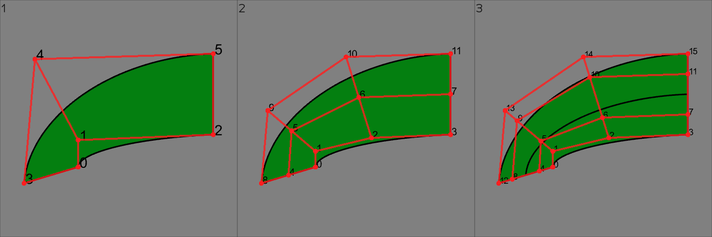
All the splines can be modified. For example, by
1. directly accessing properties,
2. [elevating degrees](https://tataratat.github.io/splinepy/_generated/splinepy.spline.Spline.elevate_degrees.html#splinepy.spline.Spline.elevate_degrees),
3. [inserting knots](https://tataratat.github.io/splinepy/_generated/splinepy.bspline.BSplineBase.insert_knots.html#splinepy.bspline.BSplineBase.insert_knots),
4. [reducing degrees](https://tataratat.github.io/splinepy/_generated/splinepy.bspline.BSplineBase.reduce_degrees.html) and [removing knots](https://tataratat.github.io/splinepy/_generated/splinepy.bspline.BSplineBase.remove_knots.html) with a specified tolerance

*Note: currently {2, 3, 4} are limited to BSpline families.*
```python
# start with a copy of the original spline
modified = nurbs.copy()

# manipulate control points
# 1. all at once
modified.control_points /= 2.0
# 2. indexwise (flat indexing)
modified.control_points[[3, 4, 5]] *= [1.3, 2.]
# 3. with grid-like indexing using multi_index helper
multi_index = modified.multi_index
modified.control_points[multi_index[0, 1]] = [-1.5, -.3]
modified.control_points[multi_index[2, :]] += [2., .1]

modified.show()  # visualize Nr. 1

# elevate degrees and insert knots
modified.elevate_degrees([0, 1])
modified.show()  # visualize Nr. 2

modified.insert_knots(1, [.5])
modified.show()  # visualize Nr. 3
```

### 3. Evaluate
You can evaluate spline's basis functions, mapping, and their derivatives by giving parametric coordinate queries.
They should be 2D array-like objects and functions return 2D np.ndarray.
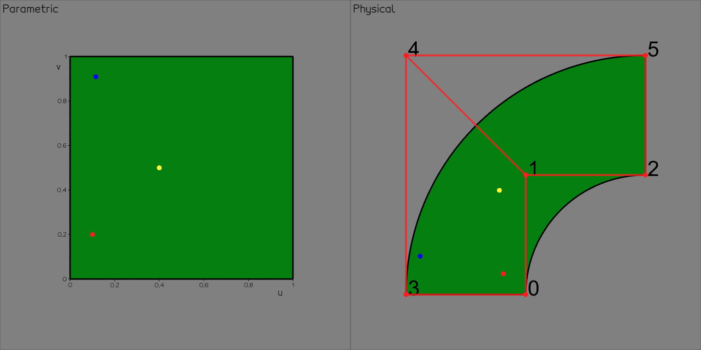
```python
# first, create parametric coordinate queries
queries = [
    [0.1, 0.2],  # first query
    [0.4, 0.5],  # second query
    [0.1156, 0.9091],  # third query
]

# evaluate basis, spline and derivatives.
# for derivatives, specify order per parametric dimension.
basis = nurbs.basis(queries)
basis_derivative = nurbs.basis_derivative(queries, [1, 1])
physical_coordinates = nurbs.evaluate(queries)
physical_derivatives = nurbs.derivative(queries, [2, 0])
```
Many of splinepy's multi-query functions can be executed in parallel using multithread executions on c++ side. For that, set either the global flag or pass the `nthreads` argument.
```python
p_basis0 = nurbs.basis(queries, nthreads=2)
# or
splinepy.settings.NTHREADS = 3
p_basis1 = nurbs.basis(queries)
```
We also implemented [point inversion](https://tataratat.github.io/splinepy/_generated/splinepy.spline.Spline.proximities.html#splinepy-spline-spline-proximities) for splines.
```python
# see docs for options
para_coordinates = nurbs.proximities(physical_coordinates)

import numpy as np
assert np.allclose(queries, para_coordinates)
```
In cases, where you may have to compute derivatives at the inverted locations or you just want to know more information about the search, you can set the keyword `return_verbose=True`:
```python
(
    parametric_coordinates,
    physical_coordindates,
    physical_difference,
    distance,
    convergence_norm,
    first_derivatives,
    second_derivatives,
) = nurbs.proximities(physical_coordinates, return_verbose=True)
```

### 4. Helper Modules
There's a list of helper modules under the namespace `splinepy.helpme` to boost prototyping efficiencies. Please check out the full list [here](https://tataratat.github.io/splinepy/_generated/splinepy.helpme.html)!
Here are some highlights.

#### 4.1 Create
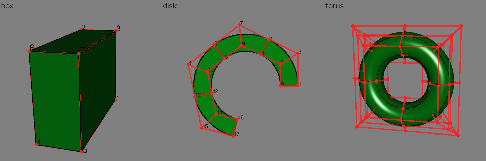
[splinepy.helpme.create](https://tataratat.github.io/splinepy/_generated/splinepy.helpme.create.html#module-splinepy.helpme.create) module can help you create several primitive shapes and another spline based on existing spline.
```python
# basic splines
box = splinepy.helpme.create.box(1, 2, 3)  # length per dim
disk = splinepy.helpme.create.disk(outer_radius=3, inner_radius=2, angle=256)
torus = splinepy.helpme.create.torus(torus_radius=3, section_outer_radius=1.5)

splinepy.show(["box", box], ["disk", disk], ["torus", torus])
```
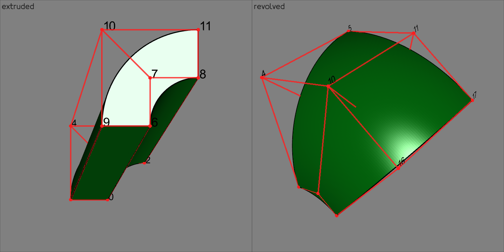
For the latter, you can directly access such functions through [spline.create](https://tataratat.github.io/splinepy/_generated/splinepy.spline.Spline.create.html#splinepy.spline.Spline.create).
```python
# based on existing splines
extruded = nurbs.create.extruded(extrusion_vector=[1, 2, 3])
revolved = nurbs.create.revolved(axis=[1, 0, 0], center=[-1, -1, 0], angle=50)

splinepy.show(["extruded", extruded], ["revolved", revolved])
```

### 4.2 Extract
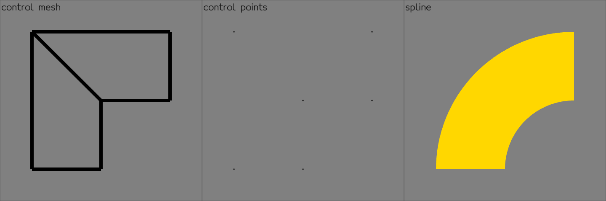
Using [splinepy.helpme.extract](https://tataratat.github.io/splinepy/_generated/splinepy.helpme.extract.html#module-splinepy.helpme.extract) module, you can extract meshes (as a [gustaf](https://tataratat.github.io/gustaf/index.html) object)
```python
# extract meshes as gustaf objects
control_mesh = nurbs.extract.control_mesh()
control_points = nurbs.extract.control_points()
mesh = nurbs.extract.faces([201, 33])  # specify sample resolutions

splinepy.show(
    ["control mesh", control_mesh.to_edges()],
    ["control points", control_points],
    ["spline", mesh]
)
```
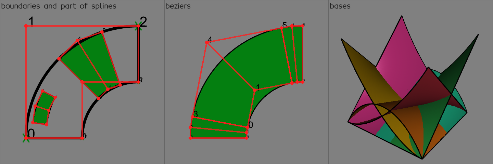
or part of splines from an existing spline using [spline.extract](https://tataratat.github.io/splinepy/_generated/splinepy.spline.Spline.extract.html#splinepy.spline.Spline.extract).
```python
# extract splines
boundaries = nurbs.extract.boundaries()
partial = nurbs.extract.spline(0, [.5, .78])
partial_partial = nurbs.extract.spline(0, [.1, .3]).extract.spline(1, [.65, .9])
bases = nurbs.extract.bases() # basis functions as splines
# insert knots to increase number of bezier patches
inserted = nurbs.copy()
inserted.insert_knots(0, [.13, .87])
beziers_patches = inserted.extract.beziers()

splinepy.show(
    ["boundaries and part of splines", boundaries, partial, partial_partial],
    ["beziers", beziers_patches],
    ["bases", bases],
)
```

#### 4.3 Free-form deformation
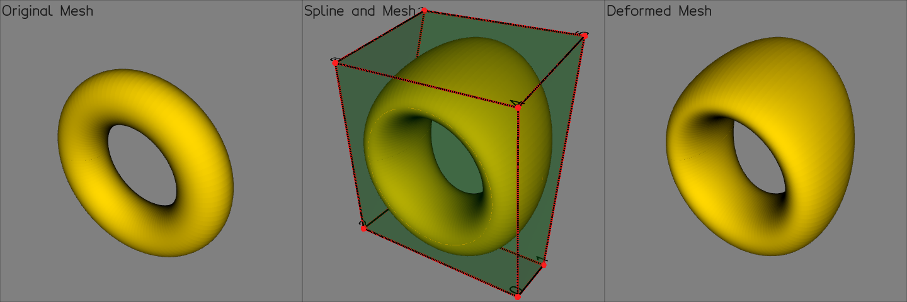
Together with mesh types of [gustaf](https://tataratat.github.io/gustaf), we can perform [free-form deformation](https://tataratat.github.io/splinepy/_generated/splinepy.helpme.ffd.FFD.html)
```python
import gustaf as gus

# create gustaf mesh using extract.spline()
# or use gustaf's io functions (gustaf.io)
mesh = splinepy.helpme.create.torus(2, 1).extract.faces([100, 100, 100])

# initialize ffd and move control points
ffd = splinepy.FFD(mesh=mesh)
multi_index = ffd.spline.multi_index
ffd.spline.control_points[multi_index[-1,:,-1]] += [3, .5, .1]

ffd.show()

# get deformed mesh - FFD.mesh attribute deforms mesh before returning
deformed = ffd.mesh
```

#### 4.4 Fitting
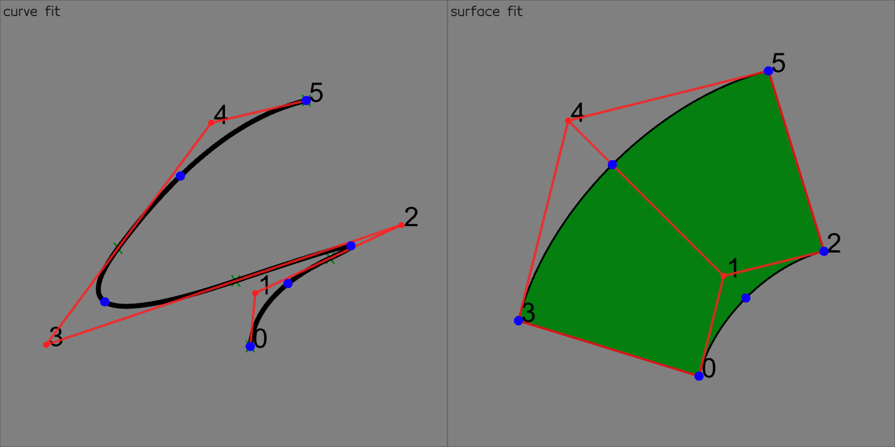
You can [fit](https://tataratat.github.io/splinepy/_generated/splinepy.helpme.fit.html#module-splinepy.helpme.fit) your point data using splines.
```python

data = [[-0.955,  0.293], [-0.707,  0.707], [-0.293,  0.955],
        [-1.911,  0.587], [-1.414,  1.414], [-0.587,  1.911]]

curve, residual_curve = splinepy.helpme.fit.curve(data, degree=2)
# you can also use any existing spline's basis
surface, residual_surface = splinepy.helpme.fit.surface(
    data, size=[3, 2], fitting_spline=nurbs
)

# set visuals for data
d = gus.Vertices(data)
d.show_options.update(c="blue", r=15)

splinepy.show(
    ["curve fit", d, curve],
    ["surface fit", d, surface],
)
```

#### 4.5 Mapper
 <p align="center"></p>

[Mapper](https://tataratat.github.io/splinepy/_generated/splinepy.helpme.mapper.Mapper.html#splinepy.helpme.mapper.Mapper) class is a geometric mapping helper that brings expression and derivatives into the physical domain.
This is especially useful for trying collocation methods. Here, we show how you can create a left hand side matrix for a laplace problem - see [this example](https://github.com/tataratat/splinepy/blob/main/examples/iga/collocation_laplace_problem_sparse.py) for a full solution:
```python
# create solution spline
solution_field = nurbs.create.embedded(1)

# refine
solution_field.elevate_degrees([0, 1])
solution_field.uniform_refine(n_knots=[4, 4])

# create matrix using mapper
# collocation points at greville abcissae
mapper = solution_field.mapper(reference=nurbs)
laplacian, support = mapper.basis_laplacian_and_support(
    solution_field.greville_abscissae()
)
laplacian_matrix = splinepy.utils.data.make_matrix(
    laplacian,
    support,
    n_cols=solution_field.control_points.shape[0],
)
```

### 5. Microstructure
(Rational) Bezier splines in splinepy are capable of [composition](https://tataratat.github.io/splinepy/_generated/splinepy.bezier.BezierBase.compose.html#splinepy.bezier.BezierBase.compose), where you can place a spline (inner spline/function) into another spline (outer spline/function) in an exact fashion.
We can systematically perform this to create certain shapes that consist of multiple inner splines.
The resulting shapes are called [microstructure](https://tataratat.github.io/splinepy/_generated/splinepy.microstructure.microstructure.Microstructure.html#splinepy.microstructure.microstructure.Microstructure)s and the inner spline that serves as a basis shape is called [tile](https://tataratat.github.io/splinepy/_generated/splinepy.microstructure.tiles.tile_base.TileBase.html#splinepy.microstructure.tiles.tile_base.TileBase).

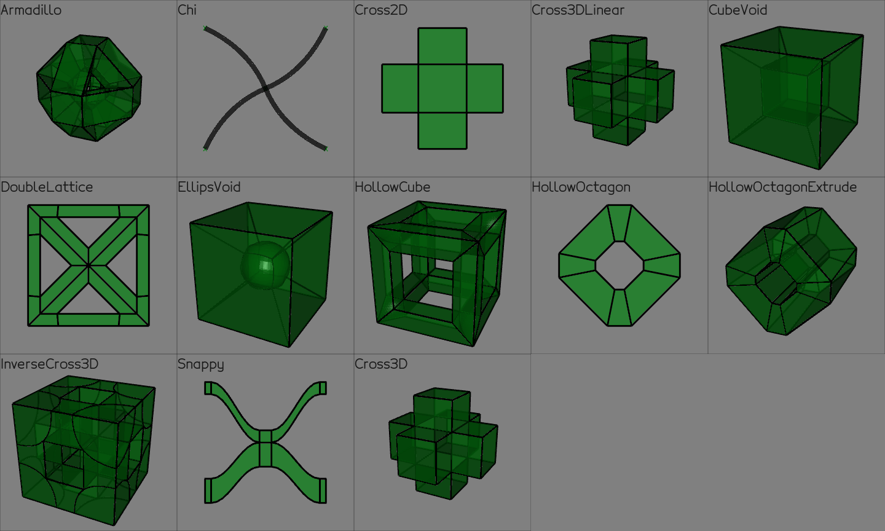
splinepy has several tiles that are ready to use.
Implementations of available tiles can be found [here](https://tataratat.github.io/splinepy/_generated/splinepy.microstructure.tiles.html).
However, it is easier to access them through [module functions](https://tataratat.github.io/splinepy/_generated/splinepy.microstructure.tiles.html):

```python
splinepy.microstructure.tiles.show()

# get specific dimensions as dict
para_2_dim_2 = splinepy.microstructure.tiles.by_dim(para_dim=2, dim=2)
dim_2 = splinepy.microstructure.tiles.by_dim(dim=2)
```

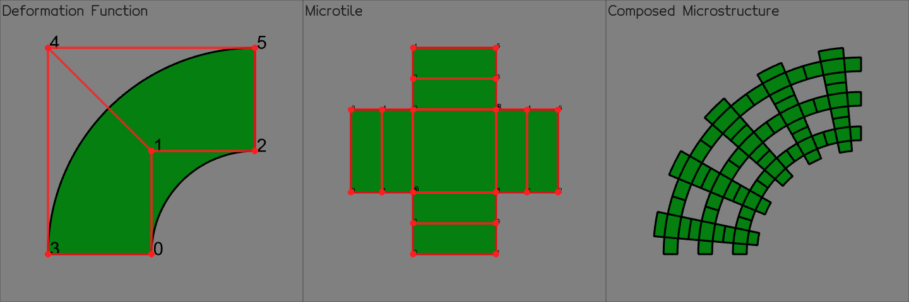

```python
# create microstructure generator
microstructure = splinepy.Microstructure()
# set outer spline and a (micro) tile
microstructure.deformation_function = nurbs
microstructure.microtile = splinepy.microstructure.tiles.get("Cross2D")
# tiling determines tile resolutions within each bezier patch
microstructure.tiling = [5, 3]

microstructure.show()

# extract only generated parts as multipatch
generated = microstructure.create()
```

Please take a look at [this example](https://github.com/tataratat/splinepy/blob/main/examples/show_microstructures.py) for a broad overview of what microstructures can do!


### 6. Multipatch
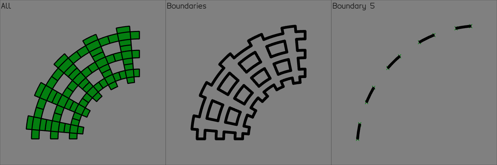
In practice, including [Microstructure](https://tataratat.github.io/splinepy/_generated/splinepy.microstructure.microstructure.Microstructure.html#splinepy.microstructure.microstructure.Microstructure)s, it is common to work with multiple patches.
For that, we provide a [Multipatch](https://tataratat.github.io/splinepy/_generated/splinepy.multipatch.Multipatch.html#splinepy.multipatch.Multipatch) class, equipped with various useful functionalities:
- patch interface identification
- boundary patch identification
- boundary assignment with various options
- subpatch / boundary patch extraction
```python
# use previously generated microtiles
interface_info_array = generated.interfaces

# Mark boundaries to set boundary conditions
# In case of micro structure, you can use outer spline's boundary
def is_left_bdr(x):
    left = nurbs.extract.boundaries()[3]
    return (left.proximities(x, return_verbose=True)[3] < 1e-8).ravel()

generated.boundary_from_function(is_left_bdr, boundary_id=5)

splinepy.show(
    ["All", generated],
    ["Boundaries", generated.boundary_multipatch()],
    ["Boundary 5", generated.boundary_multipatch(5)]
)

# export for the solver
splinepy.io.gismo.export("microstructure.xml", generated)
```


### 7. Input/output and vector graphics
splinepy supports various [IO formats](https://tataratat.github.io/splinepy/_generated/splinepy.io.html).
Most notably, [gismo](https://github.com/gismo/gismo) and [mfem](https://github.com/mfem/mfem) formats allow seamless transition to analysis.
```python
# export
splinepy.io.mfem.export("quarter_circle.mesh", nurbs)

# load
quarter_circle = splinepy.io.mfem.load("quarter_circle.mesh")
```
 <p align="center"></p>


[svg format](https://tataratat.github.io/splinepy/_generated/splinepy.io.svg.export.html#splinepy.io.svg.export) enables true vector graphic export which preserves the smoothness of splines for publications/documentation. Try to zoom in!
```python
splinepy.io.svg.export("nurbs.svg", nurbs)
```

## Try online
You can also try splinepy online by clicking the [Binder](https://mybinder.org/v2/gh/tataratat/try-splinepy/main) badge above!

## Contributing
splinepy welcomes any form of contributions!
Feel free to write us an [issue](https://github.com/tataratat/splinepy/issues) or start a [discussion](https://github.com/tataratat/splinepy/discussions).
Contribution guidelines can be found [here](https://tataratat.github.io/splinepy/CONTRIBUTING.html).
